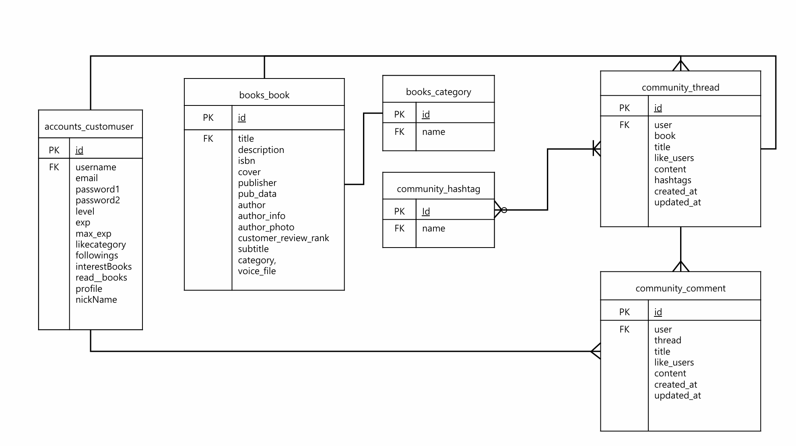

1. 팀원 정보 및 업무 분담 내역 
- 한상래(팀장) Frontend - Vue.js를 이용한 웹페이지의 구성과 사용자가 사용하는 화면 전반적인 내용을 Backend서버에서 받아와 화면에 출력하였습니다. Backend 서버에 알맞은 요청을 하며 Back서버에 요청을 하고 데이터를 전달 받았습니다.  
- 임서현(팀원) Backend  - Django를 이용해 사용자에게 요청이 오면 알맞은 정보를 serializer로 직렬화 하여 json 형식으로 정보를 전달하였습니다. 전반적인 Data를 관리하며 요청이 오면 알맞은 응답을 하였습니다. 

2. 목표 서비스 구현 및 실제 구현 정도
- 책 정보 제공과 커뮤니티 기능 - 책 정보를 가져와 사용자에게 제공하고 해당 책에 대한 스레드 , 스레드에 대한 댓글 기능을 구현하였습니다.  
- 플레이어 레벨과 그에 따른 캐릭터 외형: 플레이어 레벨과 exp 기능을 구현하였지만 캐릭터를 넣지는 못하였습니다. 
- AI 인터렉티브 콘텐츠: GPT를 이용한 인터렉티브 콘텐츠를 기획 하였습니다. 챗봇에게 기분에 따른 책 추천, 읽은 독서에 대한 퀴즈, 독서 토론을 구현하여 사용자의 흥미를 이끌어 냈습니다. 

3.  ERD 

4. 도서 추천 알고리즘에 대한 기술적 설명  
review_rankf를 이용하여 탑 20 책을 메인 페이지에 추천하였고 챗gpt api를 이용하여 챗gpt의 프롬프팅으로 사용자의 기분을 토대로 책을 추천할 수 있게 하였습니다. 사용자의 입력(기분)을 서버에 요청을 보내 그 기분을 토대로 책을 추천하는 prompt로 데이터를 생성해 Response해줍니다. 

5. 핵심 기능에 대한 설명  
- 사용자 레벨 - 사용자의 활동 부분에 exp를 올려주는 함수 적용 (maxExp <= exp 라면 lv +1 exp = exp-maxExp maxExp * 1.5 로 적용 하였습니다. )
- 챗 gpt를 이용한 인터렉티브 컨텐츠: chatgpt api를 이용하여 프롬프팅으로 원하는 데이터 값을 얻어내 독서퀴즈, 독서 토론 , 독서 추천을 구현하였습니다. 

6. 생성형 AI를 활용한 부분 
- 독서 토론: 책 제목을 전달하고 사용자가 의견을 제시하여 gpt의 의견을 받습니다. 

- 독서 퀴즈: 책 제목을 전달하고 json 형식으로 quize, answer, option으로 응답을 받아 퀴즈와 정답 선택지를 전달합니다. option은 A, B , C , D로 
문제가 주어집니다. 

7. 기타 (느낀점, 후기 등)
처음으로 진행한 백엔드 + 프론트엔드 프로젝트로 직접 데이터를 관리하고 요청과 응답을 통하여 웹의 동작을 구현하였습니다. 수업 시간에 배운 내용을 적극적으로 활용하며 점점 웹페이지가 만들어지고 동작이 추가되어 나가는 과정이 신기하고 재미있었습니다. 팀원과 소통이 원활하게 진행되어 재미있게 프로젝트에 참여한 것 같습니다. 